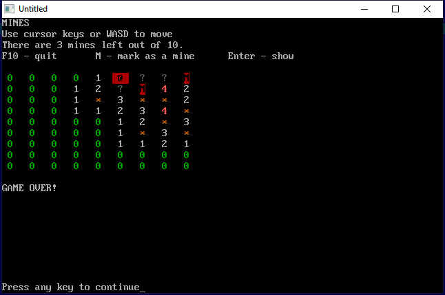
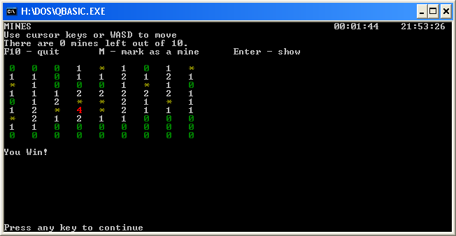

# Qbasic-Minesweeper
Qbasic console implementation of the Minesweeper game. Also works with [QB64](http://www.qb64.net/).

For some reason it currently doesn't work with QB64 on Linux (probably key event trapping), but it works OK with Windows.

I developed this program under MS-DOS Version 6.22 with Qbasic (in 2019) and transfered it on a 3.5" floppy to a Linux computer from which I commit.

## Screenshots

 
_QB 64 screenshot_

 
_MS-DOS Qbasic running under Windows XP_
